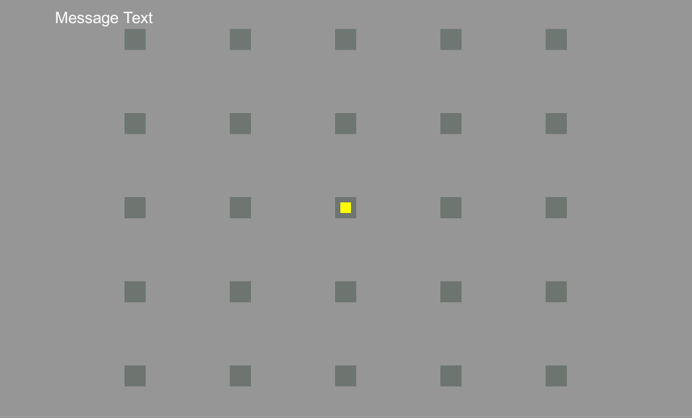

# Unity3D and SR Eyelink Portable Duo Integration - Project Template
This repository contains resources to assist in using SR Research eye tracker products with Unity3D.

**Note: This repository is a work in progress.**

## Sample Environment
An example Unity3D executable can be located in the [Builds folder](https://github.com/ShortFox/Eyelink-Unity-Integration/tree/main/Unity/Eyelink-Unity-Integration/Builds). Make sure to keep the contents of the folder together when executing the application _Eyelink-Unity-Integration.exe_

### Instructions
Ensure the SR eye-tracker and associated computer is connected to the display computer (which will run the Unity3D application) and is powered on.

When opening the application, you may be prompted to select the display resolution. Please select the native resolution of the display monitor. Once the application is opened, you will see the below image:

"Message Text" will state the (x,y) pixel coordinate of gaze data. The central yellow square will track the gaze data on the screen. The gray squares will highlight green if the yellow square intersects.

The following keyboard shortcuts are available to you:
* **C:** Enter SR "TrackerSetup" application. This will launch a new window where you can perform tracker setup, calibration, validation and drift correct. The SR computer is set to listen to key commands from the display computer to facilitate tracker setup. Pres _Esc_ to exit.
* **D:** Enter SR's drift correction mode. This will launch a new window where you can perform drift correction. Following a drift check, the drift correction is automatically applied and the application will return to Unity3D.
* **G:** Toggle whether the yellow square tracks gaze data.
* **P:** Start drawing gaze data from eye-tracker to screen. This is automatically called following a tracker setup (C) or drift correction (D). This will also enable the "Message Text" and yellow square game components.
* **Q:** Stop drawing gaze data from eye-tracker to screen. This is automatically called before triggering a tracker setup (C) or drift correction (D). This will also disable the "Message Text" and yellow square game components.
* **SPACE:** This will perform a gaze offset within the Unity3D environment without affecting the eye-tracker's calibration. The offset is set to the center of the game screen.

**Typical Operation:** Press **C** to start tracker setup. When the tracker setup application opens, press **C** to calibrate, **ENTER** to accept, **V** to validate, **ENTER** to accept, **D** to perform direct correction, **ENTER** to accept. Then press **ESC** to return to Unity. Once returned to Unity, press **G** to show the location of the gaze, **D** to perform and apply drift correction, and **Q** to close connection to eye-tracker.

To close, force quit the application.

## Unity3D Project
The Unity3D project is located within the [Unity folder](https://github.com/ShortFox/Eyelink-Unity-Integration/tree/main/Unity/Eyelink-Unity-Integration). The application scene can be found in the [Scenes folder](https://github.com/ShortFox/Eyelink-Unity-Integration/tree/main/Unity/Eyelink-Unity-Integration/Assets/Scenes).

The relevant application [scripts](https://github.com/ShortFox/Eyelink-Unity-Integration/tree/main/Unity/Eyelink-Unity-Integration/Assets/Scripts) are the following:

* **ScreenToPosition.cs** updates the yellow square's position by converting the screen gaze position to world space. This position is updated if __toggleGaze_ is set to true.
* **Debug_ConnectAndSetGazeSimple.cs** handles eye-tracker connection, tracker setup and drift correction. This script is found within the [Debug folder](https://github.com/ShortFox/Eyelink-Unity-Integration/tree/main/Unity/Eyelink-Unity-Integration/Assets/Scripts/Debug).

## EyelinkTrackerSetup C# Windows Form Application
Unity3D creates a new process which handles the SR tracker setup and drift correction. The project solution can be found in the [EyelinkTrackerSetup folder](https://github.com/ShortFox/Eyelink-Unity-Integration/tree/main/Helper%20Programs). The main program is found in _Program.cs_. The program expects one of two optional parameters: _setup_ which will perform SR's tracker setup, or _driftCorrect_ which will check and apply a drift correction. The application returns 0 if there are no errors. This application is modeled after SR's C# example, [elconnect](https://github.com/ShortFox/Eyelink-Unity-Integration/tree/main/Helper%20Programs) which is also included for reference.

## Contact

Questions, suggestions or comments? Contact Dr. Patrick Nalepka ([ShortFox](https://github.com/ShortFox)).
